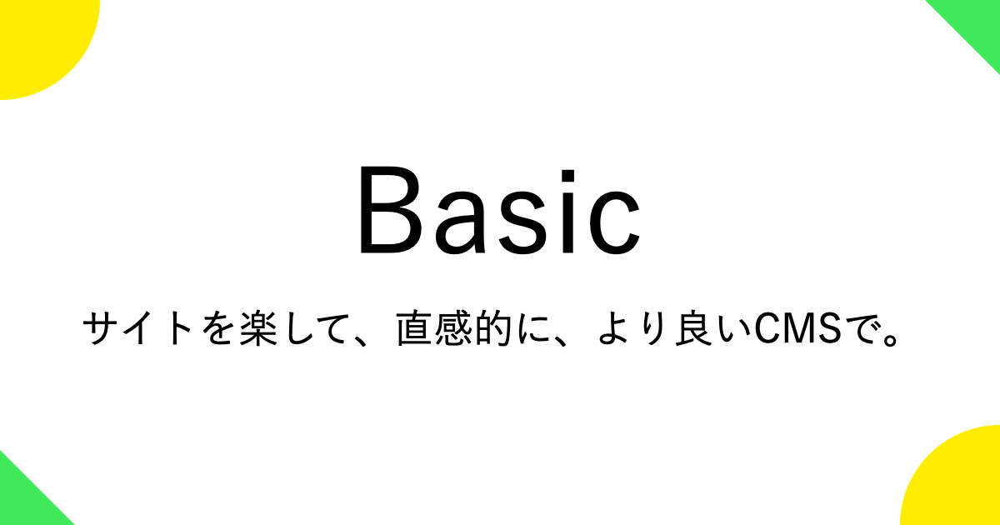

[](https://php.net/)
[](https://github.com/mtoksuy/basic)
[](https://github.com/mtoksuy/basic/network)
[](https://github.com/mtoksuy/basic/stargazers)


# なぜBasic？
私たちは、インターネットが大好きです。そんなインターネットを作り続ける人たちに向けてBasicを作りました。サービスを作る人にもECサイトを運営する人にもブログを書く人にもどんな些細なメリットでも届けたいんです。その答えとして‪コンテンツを作る「CMS」‬の悩みを解決しようと考えました。近年、ページの表示スピードに対する評価は高まりつつあります。その表示スピードを遅くしている要因として‪「CMS」‬が挙げられます。他にも複雑なCMS、カスタマイズ、UX、最新画像フォーマットと問題は山積みです。それらを最適化しBasicを通じてインターネットを作る全てを人たちの問題を解決していきます。
# Basicの特徴
- 🐰 スピードに特化したCMS
- 🐵 世界で一番シンプルなCMS
- 🐶 完全無料のCMS
- 🐻 デベロッパー・ファースト
- 🐱 ノーコードでも楽々構築
- 🐼 webPに完全対応
- 🐭 超軽量化で超高速配信
- 🐯 SEOにつよつよ
- 🦊 管理が簡単

# Demo
<div align="center">
<table>
<tbody>
<td align="center">
<br>
<sub>デモを試したい方はこちら <a href="https://basic.dance/demo/login/">Demo</a></sub><br>

</td>
</tbody>
</table>
</div>


# Basicセットアップ
## 0.事前準備
- 開発環境(ローカル) or サーバーを用意する
- DBを準備する
## 1.サーバーからダウンロード
rootでsshログインしている前提でセットアップ方法を記述しています。
```
## 移動
cd var/www/html
## ダウンロード
wget https://github.com/mtoksuy/basic/archive/refs/tags/v0.9.15.zip
## zip解凍
unzip v0.9.15.zip
## zip削除
rm -r -f v0.9.15.zip
## 移動
cd /var/www/html/basic-0.9.15/
## basicファイル群移動
mv * .* /var/www/html/
"."と".."をどうするか求められますが、スルーしてエンターを押してください。
## 移動
cd /var/www/html/
## 空のディレクトリ削除
rmdir /var/www/html/basic-0.9.15/
## 権限変更
chown -R apache:apache /var/www/html
```
## 2.ローカルからアップロード
### 2-1.Download ZIP
https://github.com/mtoksuy/basic/archive/refs/tags/v0.9.15.zip

でローカルにダウンロードして開発している前提でセットアップ方法を記述してます。
#### 2-1-1.FTPなどでアップロード
アップロードする際の注意点ですが、ユーザー：apache でアップロードして下さい。

難しい場合はサーバーにsshにてrootでログイン後
```
chown -R apache:apache /var/www/html
```
でroot配下の所有者・グループを apache に変更をします。

## 3.うまく表示できない場合、確認するポイント
- 所有者・グループが apache なっているか確認
- ローカルからアップ後DB接続できない場合は setting/db_config.php の設定を確認
- 設定しているDBがあるか確認
- サーバーにDB(mysql, MariaDBなど)がインストールされてるか確認
- サーバーにPHPがインストールされてるか確認
- パケットフィルタリングなどで80 or 443のポートが通ってるか確認

---

[Basic - サイトを楽して、直感的に、より良いCMSで。](https://basic.dance)
